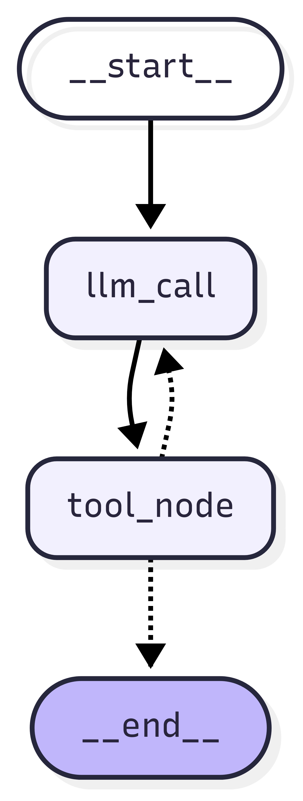
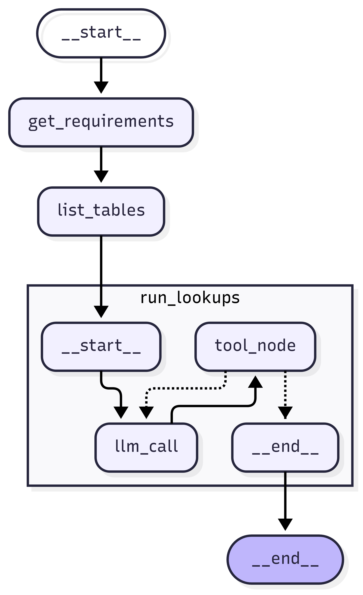
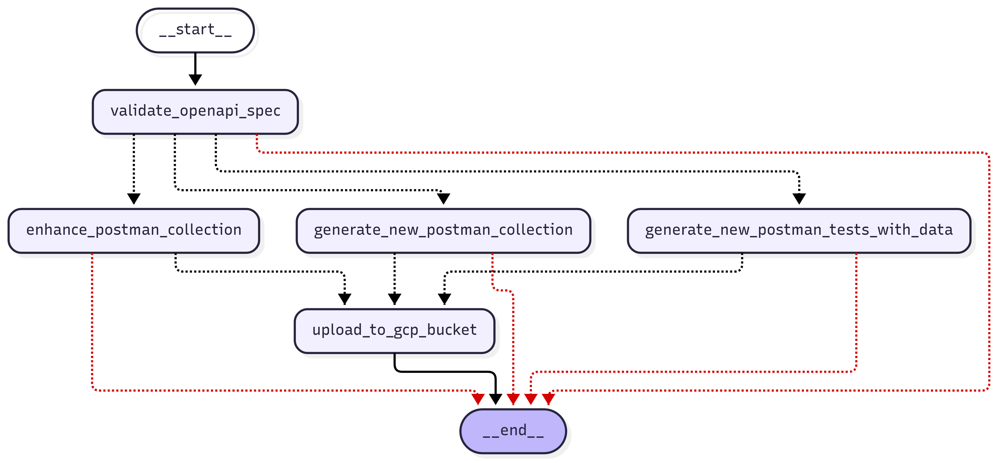
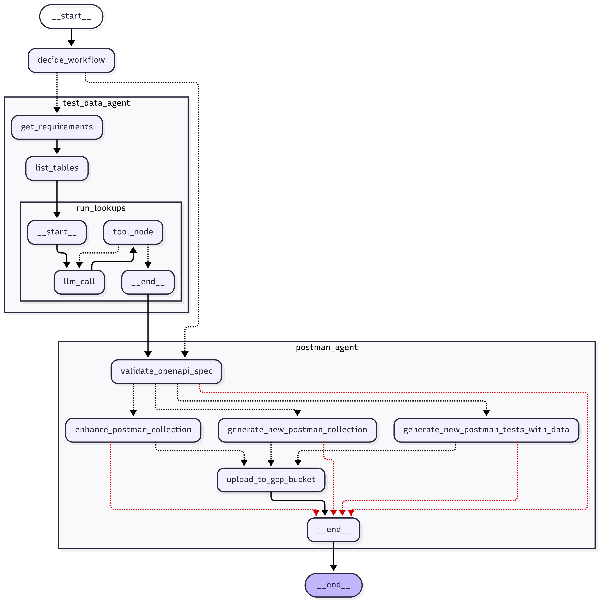

# Test case generation agent
This is an initial POC, so this agent only handles unit test cases. While i had a very similar testing agent, based in Google ADK, this repo is heavily inspired by https://blog.langchain.com/open-deep-research/. 

## Data search agent ([data_agent.py](data_agent.py) and [database_tools.py](database_tools.py))

The data search agent is responsible for intelligently searching and retrieving data from databases to support test case generation. It consists of two main components:

**data_agent.py**: Implements a LangGraph-based agent that uses GPT-4o to orchestrate database operations. The agent takes a lookup query and available database tables, then intelligently decides which database operations to perform. It uses a workflow with two main nodes:
- `llm_call`: Processes the lookup query and decides what database operations to execute
- `tool_node`: Executes database tools and handles the results, updating the agent state accordingly

**database_tools.py**: Provides a suite of database interaction tools that communicate with a remote database via MCP (Model Context Protocol):
- `ListTablesTool`: Retrieves all available tables and their descriptions from the database
- `DescribeTableTool`: Gets the schema information for a specific table
- `ExecuteSQLTool`: Executes SQL queries on the database and returns results
- `MarkCompleteTool`: Marks a data search task as complete with success/failure status

The agent iteratively uses these tools to understand the database structure and find the requested data, marking tasks as complete when data is found or when all options are exhausted.

The Mark Complete Tool is conceptually very similar to the 'think tool' in Anthropic's deep research agent, essentially dynamically injecting the ability for the agent to stop and think about its actions, this allows the llm to essentially checkpoint itself at each stage, ensuring it does not end up in loops or go down one path without evaluating other options. 

## Test data agent ([test_data_agent.py](test_data_agent.py))

The test data agent orchestrates the process of generating test data for specific test scenarios. It leverages the data search agent to find relevant data from databases and structures it for test case generation.

The agent implements a three-stage workflow:
1. **get_requirements**: Uses GPT-4o-mini with structured output to analyze test scenarios and identify what data needs to be looked up from the database
2. **list_tables**: Retrieves available database tables using the MCP tools to understand what data sources are available
3. **run_lookups**: For each identified data requirement, invokes the data search agent to find and retrieve the actual data from the database

I saw many parallels with having a research orchestrator agent with sub agents for each sub research topic in the langchain article, and for testing with data I could have a test data agent that acts as an orchestrator, which can lauch sub agents (data search agents) to run lookups on the database. A task for the future would be to have these lookups run in parallel, since the task is read only, and each lookup requirement is conceptually separate this task is easily parallelizable. 

The agent saves all retrieved data to timestamped artifact files, handling both successful lookups and failed attempts. This provides a comprehensive data foundation that can be used by downstream agents for generating realistic test cases with actual database content.

## Postman generation agent ([postman_agent.py](postman_agent.py))

The postman generation agent handles the creation and enhancement of Postman collections for API testing. It supports multiple workflows for different testing scenarios:

The agent validates OpenAPI specifications and then routes to different collection generation strategies based on the task:
- **create_collection**: Generates new Postman collections from OpenAPI specs
- **enhance_collection_with_data**: Enhances existing collections by incorporating real test data from databases
- **enhance_collection**: Improves existing collections with better test cases and assertions

Key features include:
- OpenAPI specification validation to ensure API specs are properly formatted
- Integration with Google Cloud Storage for uploading generated collections
- Support for enhancing collections with realistic test data retrieved by the test data agent
- Automatic file management and artifact generation

The agent ensures that generated Postman collections are comprehensive, include realistic test data, and are properly validated before being made available for testing.

## FastAPI Application Entry Point ([main.py](main.py))

The `main.py` file serves as the primary entry point for the testing agent system, providing a FastAPI web service that integrates with Jira to automate test collection generation workflows.

### Key Features:
**Jira Integration**: The application downloads attachments directly from Jira issues, including:
- OpenAPI specifications
- Existing Postman collections
- User requirement documents

**API Endpoints**:
- `POST /run-testing-agent/`: Main endpoint that accepts Jira issue data, downloads required attachments, and orchestrates the entire testing pipeline through the main agent
- `GET /health`: Simple health check endpoint

The application acts as a bridge between Jira workflows and the LangGraph-based agent system, enabling automated test generation to be triggered directly from Jira issues with all necessary context and files automatically retrieved and processed.

## Main agent ([main_agent.py](main_agent.py))

The main agent serves as the orchestrator that coordinates the test data agent and postman generation agent based on the specific testing requirements. It implements intelligent workflow routing to optimize the testing pipeline.

The orchestrator uses a decision-based workflow:
1. **decide_workflow**: Analyzes the task type to determine if data enhancement is needed
   - For `enhance_collection_with_data` tasks: Routes to test data agent first to gather database content
   - For other tasks: Routes directly to postman agent
2. **run_test_data_agent**: Executes the test data agent when real database content is needed for test cases
3. **run_postman_agent**: Executes the postman generation agent to create or enhance API test collections

This architecture ensures efficient resource utilization - the potentially expensive database lookup operations are only performed when test scenarios specifically require real data. The main agent coordinates the entire pipeline, ensuring that data flows correctly between agents and that the final output meets the testing requirements.

N.B. Langchain is definitely more complex to use than ADK, but that was a given since less details are abstracted away. But as we begin to build workflow agents with more complex functionality, I believe we're going to need to be able to create agents where the logic is composed of sections of deterministic code and sections of LLMs with tool calls. Relying on agents to execute the deterministic parts of our workflow is unecessary, for now, I feel that we should be assinging these LLMs with minimal and focused responsibilities, giving them only what they really need to be able to - that is where langchain works really well. Of course, this may all be common knowledge, but the more we share, the more we learn. I'd be interested in exploring how we might establish some patterns or guidelines for when to use deterministic code versus agentic behavior as our workflows grow in complexity.

